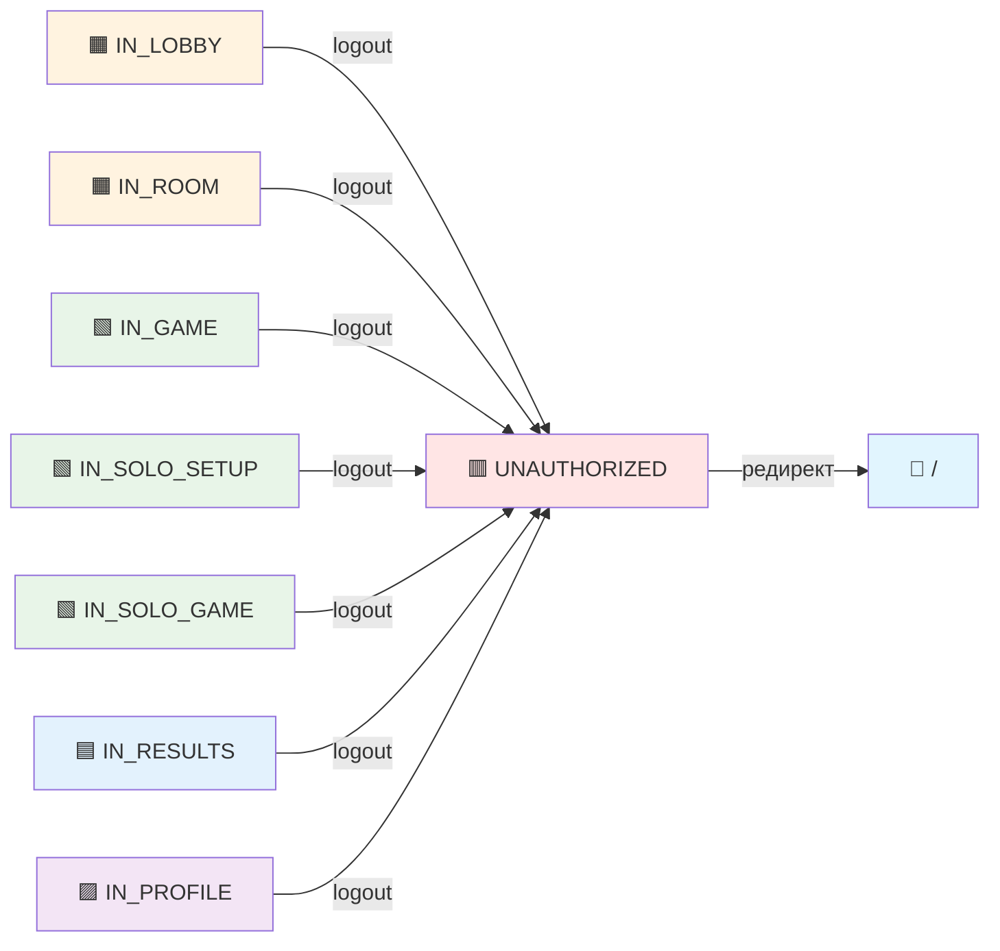
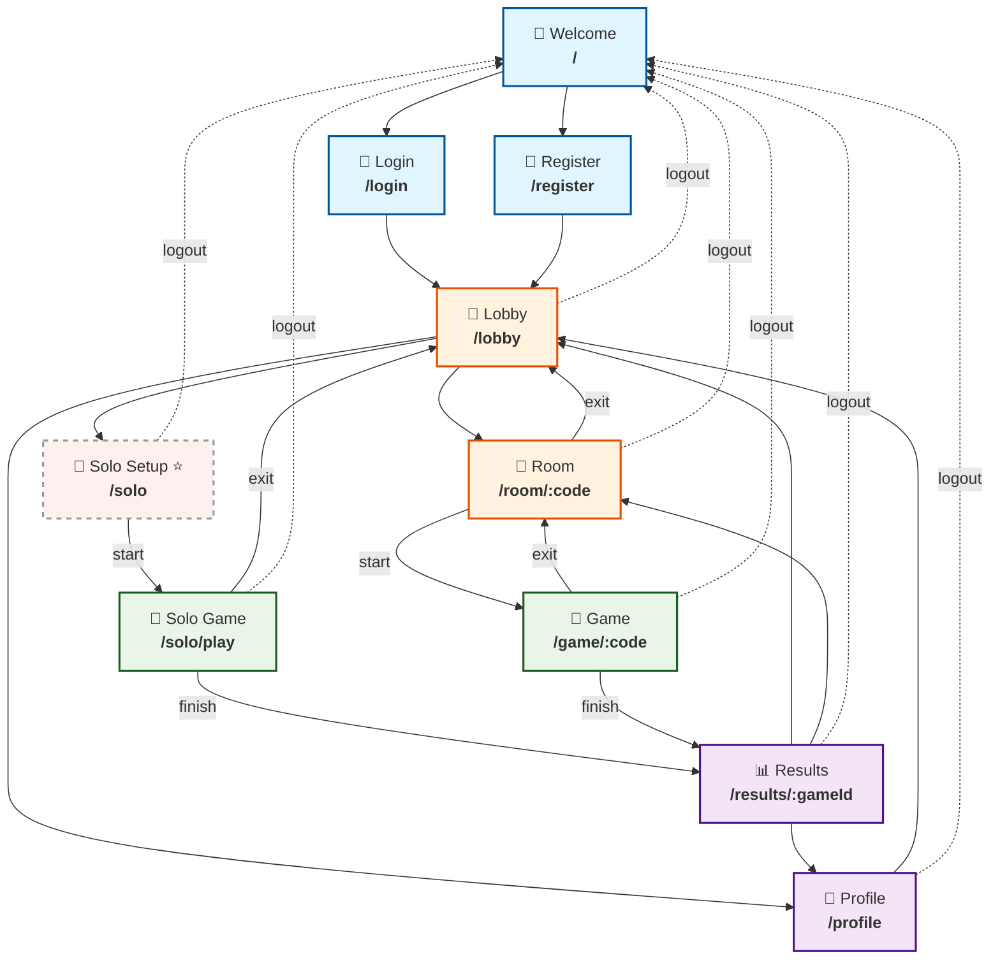
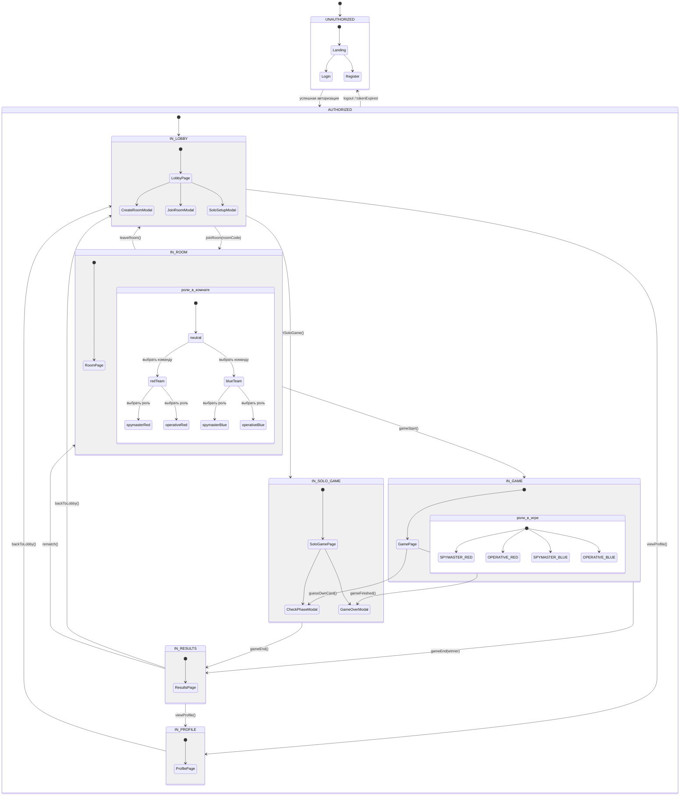

# Техническое задание: Nova Codenames Game

<details>
<summary>📚 Список референсов</summary>

### Основные материалы
| № | Название | Описание |
|---|----------|----------|
| 1 | [Nova Codenames Game](https://github.com/mvavilin/Nova-Codenames) |  |
| 2 | [Пример 2: Codenames – Interview Edition](https://github.com/rolling-scopes-school/tasks/blob/master/stage2/tasks/rs-tandem/examples/02-codenames-game.md) | Основная концепция, правила игры и UI mockups |
| 3 | [Codenames – Interview Edition: Архитектурные варианты](https://github.com/rolling-scopes-school/tasks/blob/master/stage2/tasks/rs-tandem/examples/02-codenames-game/README.md) | Custom WS vs Firebase |
| 4 | [Вариант A: Custom WS Server (Node.js + Socket.IO)](https://github.com/rolling-scopes-school/tasks/tree/master/stage2/tasks/rs-tandem/examples/02-codenames-game/variant-a) | Почему выбран Custom WS, команда, стек |

### Документация варианта А (Custom WS)
| № | Название | Описание |
|---|----------|----------|
| 5 | [AI Spymaster & Mock Implementation Guide](https://github.com/rolling-scopes-school/tasks/blob/master/stage2/tasks/rs-tandem/examples/02-codenames-game/variant-a/ai-spymaster.md) | AI интерфейсы + Mock Implementation (вкл. hardcoded MVP), Solo Mode, AI Pre-generation |
| 6 | [Check Phase: Проверка знаний](https://github.com/rolling-scopes-school/tasks/blob/master/stage2/tasks/rs-tandem/examples/02-codenames-game/variant-a/check-phase.md) | Фаза проверки знаний: попап, банк вопросов, Self/Peer и AI режимы, отдельный Check-таймер |
| 7 | [Game Engine: Архитектура и State Machine](https://github.com/rolling-scopes-school/tasks/blob/master/stage2/tasks/rs-tandem/examples/02-codenames-game/variant-a/game-engine.md) | Server State Machine, Room Management, Board Generation, DevTools, Headless Testing |
| 8 | [Data Contracts: Codenames – Interview Edition](https://github.com/rolling-scopes-school/tasks/blob/master/stage2/tasks/rs-tandem/examples/02-codenames-game/variant-a/data-contracts.md) | TypeScript типы, WebSocket протокол, AI интерфейсы, Shared Types (monorepo) |
| 9 | [Scoring & Plan: Codenames – Interview Edition](https://github.com/rolling-scopes-school/tasks/blob/master/stage2/tasks/rs-tandem/examples/02-codenames-game/variant-a/scoring-and-plan.md) | Расчёт баллов (6 человек), 6-недельный план работ, Cut Scope Strategy |
| 10 | [Risks & Mitigations: Codenames – Interview Edition](https://github.com/rolling-scopes-school/tasks/blob/master/stage2/tasks/rs-tandem/examples/02-codenames-game/variant-a/risks-and-mitigations.md) | Bus Factor, WS-Dev SPOF, Cold Start, Session Token, debugging, race conditions |

</details>

<details>
<summary>📋 Содержание</summary>

1. [Общая информация](#1-общая-информация)
    - 1.1. [Название проекта](#11-название-проекта)
    - 1.2. [Цель проекта](#12-цель-проекта)
    - 1.3. [Целевая аудитория](#13-целевая-аудитория)

2. [🎮 Концепция игры](#2-концепция-игры)
    - 2.1. [Оригинальная игра Codenames](#21-оригинальная-игра-codenames)
    - 2.2. [Образовательная адаптация](#22-образовательная-адаптация)
    - 2.3. [Уникальные особенности](#23-уникальные-особенности)

3. [📜 Правила игры](#3-правила-игры)
    - 3.1. [Подготовка к игре](#31-подготовка-к-игре)
    - 3.2. [👤 Роли игроков](#32-роли-игроков)
    - 3.3. [🔄 Игровой процесс](#33-игровой-процесс)
    - 3.4. [❓ Фаза Check (проверка знаний)](#34-фаза-check-проверка-знаний)
    - 3.5. [🏆 Условия победы](#35-условия-победы)

4. [⚙️ Функциональные требования](#4-функциональные-требования)
    - 4.1. [📱 Страницы приложения](#41-страницы-приложения)
        - 4.1.1. [👋 Welcome / Landing](#411-welcome--landing)
        - 4.1.2. [🔑 Login](#412-login)
        - 4.1.3. [📝 Register](#413-register)
        - 4.1.4. [🏨 Lobby](#414-lobby)
        - 4.1.5. [🚪 Room](#415-room)
        - 4.1.6. [🎯 Game (мультиплеер)](#416-game-мультиплеер)
        - 4.1.7. [🧪 Solo Game](#417-solo-game)
        - 4.1.8. [📊 Results](#418-results)
        - 4.1.9. [👤 Profile](#419-profile)
    - 4.2. [🔐 Статусы пользователя и маршрутизация](#42-статусы-пользователя-и-маршрутизация)
        - 4.2.1. [Статусная модель пользователя](#421-статусная-модель-пользователя)
        - 4.2.2. [Матрица доступности страниц](#422-матрица-доступности-страниц)
        - 4.2.3. [Таблица переходов между статусами](#423-таблица-переходов-между-статусами)
        - 4.2.4. [Порядок выхода из системы (logout)](#424-порядок-выхода-из-системы-logout)
    - 4.3. [🎲 Основные механики](#43-основные-механики)
        - 4.3.1. [🏠 Создание и управление комнатами](#431-создание-и-управление-комнатами)
        - 4.3.2. [👥 Распределение команд и ролей](#432-распределение-команд-и-ролей)
        - 4.3.3. [🃏 Генерация игрового поля](#433-генерация-игрового-поля)
        - 4.3.4. [💡 Подсказки капитана](#434-подсказки-капитана)
        - 4.3.5. [🗳️ Процесс угадывания](#435-процесс-угадывания)
        - 4.3.6. [✅ Проверка знаний (Check Phase)](#436-проверка-знаний-check-phase)
        - 4.3.7. [⏱️ Таймеры хода и проверки](#437-таймеры-хода-и-проверки)
        - 4.3.8. [🏁 Завершение игры и подсчет результатов](#438-завершение-игры-и-подсчет-результатов)
    - 4.4. [🔍 Режимы проверки знаний](#44-режимы-проверки-знаний)
        - 4.4.1. [👥 Взаимооценка](#441-взаимооценка)
        - 4.4.2. [🤖 AI проверка (мок)](#442-ai-проверка-мок)
    - 4.5. [🧑‍💻 Solo режим](#45-solo-режим)
        - 4.5.1. [🤖 AI в роли капитана](#451-ai-в-роли-капитана)
        - 4.5.2. [⚡ Настройки сложности](#452-настройки-сложности)

5. [🎨 Пользовательский интерфейс](#5-пользовательский-интерфейс)
    - 5.1. [📐 Общие требования](#51-общие-требования)
    - 5.2. [🖼️ Макеты экранов](#52-макеты-экранов)
        - 5.2.1. [🎴 Игровое поле](#521-игровое-поле)
        - 5.2.2. [🪟 Попап проверки знаний](#522-попап-проверки-знаний)
        - 5.2.3. [🏨 Lobby](#523-lobby)
        - 5.2.4. [📈 Профиль и статистика](#524-профиль-и-статистика)
    - 5.3. [📱 Адаптивный дизайн](#53-адаптивный-дизайн)
    - 5.4. [✨ Анимации](#54-анимации)

6. [🛠️ Технический стек](#6-технический-стек)
    - 6.1. [🖥️ Frontend](#61-frontend)
    - 6.2. [⚙️ Backend](#62-backend)
    - 6.3. [🗄️ База данных / BaaS](#63-база-данных--baas)
    - 6.4. [🧰 Инструменты разработки](#64-инструменты-разработки)

7. [🏗️ Архитектура проекта](#7-архитектура-проекта)
    - 7.1. [📐 Выбранный архитектурный вариант](#71-выбранный-архитектурный-вариант)
    - 7.2. [📁 Структура проекта (monorepo)](#72-структура-проекта-monorepo)
    - 7.3. [🔄 Клиент-серверное взаимодействие](#73-клиент-серверное-взаимодействие)
    - 7.4. [💾 Управление состоянием](#74-управление-состоянием)
    - 7.5. [🔒 Безопасность](#75-безопасность)

8. [📎 Приложения](#8-приложения)
    - 8.1. [📖 Глоссарий терминов](#81-глоссарий-терминов)
    - 8.2. [📚 Список концептов для банка вопросов](#82-список-концептов-для-банка-вопросов)
    - 8.3. [❓ Примеры вопросов](#83-примеры-вопросов)
    - 8.4. [🔀 Схема взаимодействия страниц](#84-схема-взаимодействия-страниц)
        - 8.4.1. [📍 Карта страниц приложения](#841-карта-страниц-приложения)
        - 8.4.2. [📍 Граф навигации](#842-граф-навигации)
    - 8.5. [🗺️ Схема навигации и статусы пользователя](#85-схема-навигации-и-статусы-пользователя)

</details>

---

## 1. Общая информация

### 1.1. Название проекта
Nova Codenames Game

### 1.2. Цель проекта
Создание интерактивной мультиплеерной игры для подготовки к техническим собеседованиям по фронтенд-разработке (JavaScript, TypeScript, браузерные API) через геймификацию процесса проверки знаний.

### 1.3. Целевая аудитория
Junior Frontend-разработчики (студенты, выпускники курсов, стажеры), готовящиеся к техническим собеседованиям.

## 2. 🎮 Концепция игры

### 2.1. Оригинальная игра Codenames

<p align="center">
    
</p>

[Оригинальная игра Codenames (Wikipedia)](https://en.wikipedia.org/wiki/Codenames_(board_game))

### 2.2. Образовательная адаптация

Классическая механика Codenames адаптирована под формат подготовки к техническим собеседованиям:

1. **📚 Тематическое наполнение.**  
   Все слова на игровом поле – концепты JavaScript/TypeScript/Frontend: `closure`, `Promise`, `hoisting`, `event loop`, `prototype` и т. д. Каждая карточка – это не просто слово для угадывания, а тема для проверки знаний.

2. **🎯 Геймификация обучения.**  
   Очки начисляются не за угадывание, а за правильные ответы на вопросы. Процесс обучения встроен в игровой цикл: угадал → ответь на вопрос → получи очко. Соревновательный элемент мотивирует игроков лучше готовиться.

3. **🔍 Два режима проверки знаний.**  
   - **👥 Взаимооценка:** игрок отвечает, показывает эталонный ответ, затем команда соперников оценивает правильность кнопками «✅ Зачтено»/«❌ Не зачтено».
   - **🤖 AI-оценка (опционально):** ответ оценивается автоматически по ключевым словам (имитация работы LLM).

4. **💡 Практическая ценность.**  
   Игроки не просто повторяют теорию, а учатся формулировать ответы вслух или письменно. Вопросы построены по образцу реальных собеседований. Статистика в профиле показывает прогресс и зоны для улучшения.

### 2.3. Уникальные особенности

1.  **❓ Фаза проверки знаний (Check Phase).** Ключевое отличие от классической игры. Карточка открывается сразу, но очко команде засчитывается только после успешной проверки знаний. Игрок должен ответить на блиц-вопрос по выбранному концепту. Это превращает развлечение в инструмент обучения.

2.  **🔍 Два режима проверки.**
    - **👥 Взаимооценка:** команда соперников видит ответ игрока и эталонный ответ, после чего оценивает правильность кнопками «✅ Зачтено»/«❌ Не зачтено».
    - **🤖 AI-оценка (опционально):** игрок вводит ответ текстом, а AI-мок оценивает его по ключевым словам, имитируя работу нейросети.

3.  **🎮 Два режима игры.**
    - **👥 Мультиплеер:** классическая командная игра 2х2 с живыми капитанами.
    - **🧪 Соло (Solo Mode):** режим для одного игрока, где роль капитана (Spymaster) выполняет AI. Идеально для самостоятельной тренировки.

4.  **📈 Интеграция с прогрессом игрока.** Результаты каждой игры (победы, количество правильных ответов) сохраняются в профиле. Это позволяет отслеживать свой прогресс в подготовке к собеседованиям, а не просто статистику побед.

5.  **🔧 Гибкая архитектура с мокированным AI.** Все AI-компоненты (капитан в соло-режиме, оценщик ответов) реализованы через чистые интерфейсы. На первом этапе используются моки (подбор по категориям, поиск по ключевым словам), что позволяет отключить зависимость от внешних LLM-сервисов. Реальная AI-интеграция может быть добавлена позже без изменения основной логики игры.

## 3. 📜 Правила игры

### 3.1. Подготовка к игре

Процесс подготовки к игре является обязательным этапом перед началом игровой сессии и регламентируется следующим образом:

1.  **🏠 Типы комнат.** Комнаты создаются с фиксированной вместимостью: на 4, 6 или 8 человек. Это обеспечивает равное количество игроков в командах: 2 на 2, 3 на 3 или 4 на 4 соответственно.

2.  **👥 Выбор команды и роли.** Присоединяясь к комнате, игроки имеют нейтральный статус и могут до старта игры неограниченное количество раз менять свой выбор:
    - выбрать команду: 🔴 красные или 🔵 синие.
    - выбрать свободную роль: 👑 капитан (spymaster) или 🕵️ оперативник (operative).

3.  **⏱️ Запуск игры.** Как только комната полностью заполняется (достигнуто максимальное количество игроков), автоматически запускается обратный отсчет (например, 10 секунд) до старта игры.

4. **🚪 Выход из комнаты до старта.** Если во время обратного отсчета любой игрок покидает комнату, таймер немедленно сбрасывается, и комната возвращается в состояние ожидания игроков.

5.  **🎲 Автоматическое распределение.** Если по окончании обратного отсчета остались игроки с нейтральным статусом или незанятые роли, система случайным образом:
    - Распределяет нейтральных игроков по командам для достижения баланса.
    - Назначает капитанов в командах, где эта роль осталась вакантной. Остальные игроки в команде становятся оперативниками.

6.  **🃏 Генерация поля и распределение ролей.** После запуска игры всем игрокам открывается игровое поле 5x5 со словами. Однако отображение информации различается в зависимости от роли:
    - **👑 капитанам** показываются и слова, и цвета всех 25 карточек (🔴 красный, 🔵 синий, ⚪ нейтральный, 💣 бомба). Это их "карта" для создания ассоциаций.
    - **🕵️ оперативникам** видны только слова. Цвета карточек для них скрыты.

    > [_Референс Пример: что видит капитан vs оперативник_](https://github.com/rolling-scopes-school/tasks/blob/master/stage2/tasks/rs-tandem/examples/02-codenames-game/variant-a/game-engine.md#пример-что-видит-капитан-vs-оперативник)

    Распределение цветов на поле генерируется **🎲 случайным образом** по одному из двух сценариев и определяет, какая команда ходит первой (та, у которой 9 карточек):
    - **формат А (первыми ходят красные 🔴):** 9 карточек – агенты красной команды; 8 карточек – агенты синей команды; 7 карточек – мирные жители (нейтральные); 1 карточка – убийца (бомба).
    - **формат Б (первыми ходят синие 🔵):** 9 карточек – агенты синей команды; 8 карточек – агенты красной команды; 7 карточек – мирные жители (нейтральные); 1 карточка – убийца (бомба).

Команда, получающая 9 карточек, автоматически делает первый ход, что компенсирует численное преимущество соперника в количестве оставшихся карточек.

> [_Референс Жизненный цикл комнаты_](https://github.com/rolling-scopes-school/tasks/blob/master/stage2/tasks/rs-tandem/examples/02-codenames-game/variant-a/game-engine.md#жизненный-цикл-комнаты)

### 3.2. 👤 Роли игроков

В игре предусмотрены две основные роли, которые определяют доступную информацию и круг действий игрока:

1.  **👑 Капитан (Spymaster).**
    - **👁️ Видит все.** Капитану доступна полная карта поля: для каждой карточки отображается ее слово и истинный цвет (агент своей команды, агент противника, мирный житель или убийца).
    - **💡 Дает подсказки.** В свой ход капитан должен придумать и отправить подсказку в формате "одно слово + число". Эта подсказка должна ассоциироваться с определенным количеством слов его команды на поле. Например: _«Асинхронность, 3»_.
    - **🎯 Цель.** Помочь своим оперативникам угадать все слова его команды, избегая чужих слов и убийцы.

2.  **🕵️ Оперативник (Operative).**
    - **👁️ Видит только слова.** Оперативник видит на карточках только слова. Цвета карточек для него скрыты до тех пор, пока карточка не будет открыта.
    - **🗳️ Участвует в обсуждении и голосовании.** Оперативники получают подсказку от своего капитана. Чтобы выбрать карточку для хода, они должны прийти к консенсусу через голосование.
    - **🎲 Может быть выбран для проверки знаний.** Если предложенная и поддержанная большинством карточка оказывается карточкой своей команды, один из проголосовавших за нее оперативников **🎲 случайным образом** выбирается для прохождения фазы Check.
    - **❓ Проходит проверку знаний.** При выборе карточки своей команды игра ставится на паузу, и выбранный оперативник должен ответить на вопрос по концепту, обозначенному на карточке. От правильности этого ответа зависит, получит ли команда очко.
    - **🎯 Цель.** Коллективно и верно истолковать подсказки капитана, чтобы выбрать правильные карточки, и быть готовым индивидуально подтвердить свои знания, отвечая на вопросы.

### 3.3. 🔄 Игровой процесс

Игровой процесс строится на поочередных ходах команд. Каждый ход команды состоит из двух фаз: фазы подсказки (Clue Phase) и фазы угадывания (Guess Phase), которая может прерываться фазой проверки знаний (Check Phase).

1.  **🏁 Начало хода.** Сервер уведомляет всех игроков о смене хода. Капитан команды, чей наступил ход, видит интерфейс для ввода подсказки.

2.  **💡 Фаза подсказки (Clue Phase).**
    - Капитан вводит подсказку в формате: одно слово и число (например, «Область видимости, 2»).
    - После отправки подсказки, она отображается всем игрокам. Глобальный таймер хода (2 минуты) переключается в режим отсчета для фазы угадывания.

3.  **🗳️ Фаза угадывания (Guess Phase).**
    - Оперативники видят подсказку.
    - **🗳️ Процесс голосования.** Любой оперативник может кликнуть на карточку, чтобы предложить ее для угадывания. На карточке отображается счетчик голосов (например, 1/3). Голосование длится ограниченное время (например, 30 секунд) или до момента, пока не будет набрано большинство.
    - **📊 Завершение голосования.** По истечении времени голосования система анализирует результаты:
        - если за одну карточку проголосовало простое большинство, она фиксируется как выбранная.
        - если голоса разделились поровну между несколькими карточками, система **🎲 случайным образом** выбирает одну из лидирующих карточек.
    - **🎲 Выбор отвечающего.** Из числа оперативников, проголосовавших за выбранную карточку, **🎲 случайным образом** выбирается один, который будет отвечать на вопрос в случае успеха.

    ```mermaid
    flowchart TD
        A[🏁 Начало фазы угадывания] --> C[🖱️ Оперативник кликает на карточку,<br>предлагая ее для голосования]
        C --> D[🔢 На карточке отображается<br>счетчик голосов: X/Y]
        D --> E{⏱️ Истекло время<br>голосования?}
        
        E -->|❌ Нет| C
        E -->|✅ Да| F{📊 Есть явный лидер<br>с большинством голосов?}
        
        F -->|✅ Да| G[📌 Фиксируется карточка-лидер]
        F -->|🤝 Нет, ничья| H[🎲 Система случайно выбирает<br>одну из лидирующих карточек]
        
        G --> I[🎲 Из числа проголосовавших ЗА выбранную карточку<br>случайно выбирается отвечающий]
        H --> I
        
        I --> J[📤 Выбранная карточка отправляется<br>на сервер для обработки]
        J --> K[🏁 Конец фазы голосования,<br>переход к обработке клика]
        
        style A fill:#4CAF50,color:white
        style K fill:#f44336,color:white
        style G fill:#FFC107,color:black
        style H fill:#FFC107,color:black
        style I fill:#FFC107,color:black
    ```

4.  **⚙️ Обработка клика (на стороне сервера).**
    - **✅ Своя карточка:** открывается **для всех** игроков (статус карточки меняется на `revealed`), после чего игра переходит в фазу проверки знаний (**Check Phase**).
    - **❌ Чужая или нейтральная карточка:** **не открывается** для противника (ее статус и цвет остаются скрытыми). Ход команды немедленно завершается, право хода переходит к противнику. Очко не начисляется.
    - **💣 Бомба:** открывается **для всех** игроков (статус карточки меняется на `revealed`). Игра мгновенно завершается победой команды противника.

    ```mermaid
        flowchart LR
            A[👆 Игрок кликает по карточке] --> B{🎨 Определение цвета}
            
            B -->|✅ Своя| C[🃏 Карточка открывается для всех<br>status = revealed]
            B -->|💣 Бомба| D[🃏 Карточка открывается для всех<br>status = revealed]
            B -->|❌ Чужая или нейтральная| E[🃏 Карточка открывается для своей команды<br>🚫 Для противника цвет скрыт]
            
            C --> F[❓ Переход в Check Phase]
            D --> G[🏁 Игра завершена<br>Победа команды противника]
            E --> H[⏭️ Ход команды завершен<br>Право хода переходит к противнику]
            
            style A fill:#4CAF50,color:white
            style B fill:#FF9800,color:white
            style C fill:#2196F3,color:white
            style D fill:#f44336,color:white
            style E fill:#9C27B0,color:white
            style F fill:#2196F3,color:white
            style G fill:#f44336,color:white
            style H fill:#9C27B0,color:white
    ```

5.  **❓ Фаза проверки знаний (Check Phase).**
    - ⏸️ Игровой процесс приостанавливается. **Оперативник, выбранный на этапе голосования**, видит модальное окно с вопросом по данному концепту.
    - ⏱️ Запускается отдельный **Check-таймер на 30 секунд**. Важно: глобальный таймер хода (2 минуты) продолжает тикать на фоне.
    - ✍️ Игрок вводит свой ответ и отправляет его на проверку согласно режиму, установленному для комнаты (взаимопроверка).
    - 👥 Команда соперников видит ответ игрока и эталонный ответ, после чего оценивает правильность кнопками «✅ Зачтено»/«❌ Не зачтено».
    - 📊 По итогам взаимопроверки (или истечения 30-секундного таймера) игрок и все остальные получают результат: засчитано очко или нет.
    - 🪟 Модальное окно закрывается, и игра возвращается в фазу угадывания.

    ```mermaid
        flowchart TD
            A[❓ Начало Check Phase] --> B[🪟 Модальное окно с вопросом<br>по концепту]
            B --> C[⏱️ Запуск Check-таймера 30 сек<br>Глобальный таймер хода продолжает тикать]
            C --> D[✍️ Игрок вводит ответ]
            D --> E[📤 Игрок нажимает кнопку Отправить]
            E --> F[📖 Игрок нажимает кнопку Показать ответ]
            F --> G[📄 Отображается эталонный ответ]
            G --> H[👥 Команда соперников оценивает ответ<br>кнопками ✅ Зачтено / ❌ Не зачтено]
            
            H --> I{👀 Хотя бы один<br>соперник нажал Зачтено?}
            
            I -->|✅ Да| J[✅ Очко засчитано]
            I -->|❌ Нет| K[❌ Очко НЕ засчитано]
            C -->|⏱️ Таймер истек 30 сек| K
            
            J --> L[🪟 Модальное окно закрывается]
            K --> L
            
            L --> M[⏭️ Ход завершен<br>Право хода переходит к противнику]
            
            style A fill:#4CAF50,color:white
            style B fill:#FF9800,color:white
            style C fill:#FF9800,color:white
            style H fill:#2196F3,color:white
            style I fill:#f44336,color:white
            style J fill:#4CAF50,color:white
            style K fill:#f44336,color:white
            style M fill:#9C27B0,color:white
    ```

> [_Референс User Flow_](https://github.com/rolling-scopes-school/tasks/blob/master/stage2/tasks/rs-tandem/examples/02-codenames-game/variant-a/check-phase.md#user-flow)

6.  **⏭️ Завершение хода или раунда.**
    - Команда завершает ход, и право хода переходит к противнику.
    - Если во время своего хода команда открыла все свои карточки, игра немедленно завершается ее победой.

Данный цикл повторяется, пока одна из команд не выполнит условие победы. Детальное описание условий победы будет в пункте – [**3.5. Условия победы**](#35-условия-победы).

> [_Референс Ход игры (Clue -> Guess -> Check)_](https://github.com/rolling-scopes-school/tasks/blob/master/stage2/tasks/rs-tandem/examples/02-codenames-game/variant-a/game-engine.md#ход-игры-clue---guess---check)

### 3.4. ❓ Фаза Check (проверка знаний)

> [_Референс Check Phase: Проверка знаний_](https://github.com/rolling-scopes-school/tasks/blob/master/stage2/tasks/rs-tandem/examples/02-codenames-game/variant-a/check-phase.md)

### 3.5. 🏆 Условия победы

Игра завершается победой одной из команд при наступлении одного из следующих событий:

1.  **✅ Полное раскрытие карточек.** Команда побеждает, если во время своего хода она открывает **все свои карточки-агенты** (9 или 8 карточек, в зависимости от того, ходит ли команда первой).

2.  **💥 Выбор карточки-убийцы (бомбы).** Если команда в свой ход открывает карточку **💣 убийцы (бомбы)**, игра заканчивается ее **мгновенным поражением**. Победа присуждается команде противника, независимо от оставшихся на поле карточек.
    > [_Референс Пример 2: Codenames – Interview Edition_](https://github.com/rolling-scopes-school/tasks/blob/master/stage2/tasks/rs-tandem/examples/02-codenames-game.md)
3. **📴 Техническое поражение.** Если во время игры команда теряет всех оперативников или ее капитан покидает игру (и не возвращается в течение 30-секундного перерыва на переподключение), команде засчитывается техническое поражение. Победа присуждается команде противника.
    > _Примечание: 30-секундный перерыв на переподключение дается каждому отключившемуся игроку, независимо от его роли._

После победы игроки автоматически перенаправляются на **[страницу результатов 📊 (Results)](#418-results)**. В результатах отображается:

- Победившая и проигравшая команды.
- Полностью раскрытое игровое поле со всеми цветами.
- Статистика каждого игрока:
    - 👑 **Капитан:** 1 очко, если его команда победила.
    - 🕵️ **Оперативник:** количество правильных ответов (засчитанных очков) в фазе Check.

Все результаты игры сохраняются в **[профиль игрока 👤 (Profile)](#419-profile)** и влияют на его общую статистику и уровень.

## 4. ⚙️ Функциональные требования

### 4.1. 📱 Страницы приложения

#### 4.1.1. 👋 Welcome / Landing
*Будет заполнено*

#### 4.1.2. 🔑 Login
*Будет заполнено*

#### 4.1.3. 📝 Register
*Будет заполнено*

#### 4.1.4. 🏨 Lobby
*Будет заполнено*

#### 4.1.5. 🚪 Room
*Будет заполнено*

#### 4.1.6. 🎯 Game (мультиплеер)
*Будет заполнено*

#### 4.1.7. 🧪 Solo Game
*Будет заполнено*

#### 4.1.8. 📊 Results
*Будет заполнено*

#### 4.1.9. 👤 Profile
*Будет заполнено*

#### 4.1.9. 👤 Profile
*Будет заполнено*

### 4.2. 🔐 Статусы пользователя и маршрутизация

#### 4.2.1. Статусная модель пользователя
```ts
// тип роли в игре
type Team = 'RED' | 'BLUE';

// тип игровой роли
type GameRole = 'SPYMASTER' | 'OPERATIVE';

// статусная модель пользователя
type UserStatus = 
  | { type: 'UNAUTHORIZED' }                                   // неавторизован
  | { 
      type: 'AUTHORIZED'; 
      subStatus: AuthorizedSubStatus;                          // подстатус
      context?: StatusContext;                                 // контекст состояния
    };

// допустимые подстатусы авторизованного пользователя
type AuthorizedSubStatus = 
  | 'IN_LOBBY'        // в лобби, выбирает режим
  | 'IN_ROOM'         // в комнате ожидания
  | 'IN_GAME'         // в мультиплеерной игре
  | 'IN_SOLO_GAME'    // в соло-игре
  | 'IN_RESULTS'      // на странице результатов
  | 'IN_PROFILE';     // в профиле

// контекст статуса (дополнительные данные)
interface StatusContext {
  // идентификаторы
  roomCode?: string;           // код комнаты (например, "js-masters-42")
  gameId?: string;             // id текущей мультиплеерной игры
  soloGameId?: string;         // id текущей соло-игры
  resultId?: string;           // id просматриваемых результатов
  
  // ролевая информация
  team?: Team;                 // текущая команда (RED/BLUE)
  role?: GameRole;             // текущая роль (SPYMASTER/OPERATIVE)
}
```

Вот исправленная матрица с подробным перечислением:

#### 4.2.2. Матрица доступности страниц

| статус | разрешенные страницы | запрещенные страницы | редирект при нарушении |
|--------|---------------------|---------------------|----------------------|
| **🟥 UNAUTHORIZED** | • 👋 `/` (welcome)<br>• 🔑 `/login`<br>• 📝 `/register` | • 🏨 `/lobby`<br>• 🚪 `/room/*`<br>• 🎯 `/game/*`<br>• 🧪 `/solo`<br>• 🧪 `/solo/play`<br>• 📊 `/results/*`<br>• 👤 `/profile` | 🔒 `/login` |
| **🟧 IN_LOBBY** | • 🏨 `/lobby` (текущая)<br>• 👤 `/profile` (viewProfile)<br>• 🧪 `/solo` (startSolo, если есть)<br>• 🚪 `/room/:code` (createRoom / joinRoom)<br>• 🧪 `/solo/play` (start) | • 👋 `/` (только для гостей)<br>• 🎯 `/game/*`<br>• 📊 `/results/*` | 🏨 `/lobby` |
| **🟧 IN_ROOM** | • 🚪 `/room/:code` (текущая)<br>• 🏨 `/lobby` (exit)<br>• 👤 `/profile` (viewProfile, только до старта)<br>• 🎯 `/game/:code` (start) | • 👋 `/`<br>• другие комнаты 🚪 `/room/*`<br>• 🎯 `/game/*` (кроме своей)<br>• 🧪 `/solo/*`<br>• 📊 `/results/*` | текущий 🚪 `/room/:code` |
| **🟩 IN_GAME** | • 🎯 `/game/:code` (текущая)<br>• 🚪 `/room/:code` (exit)<br>• 🏨 `/lobby` (exit → confirmLeave)<br>• 📊 `/results/:gameId` (finish) | • 👋 `/`<br>• другие игры 🎯 `/game/*`<br>• 🚪 `/room/*` (кроме своей)<br>• 🧪 `/solo/*`<br>• 👤 `/profile`<br>• 📊 `/results/*` (до finish) | текущий 🎯 `/game/:code` |
| **🟩 IN_SOLO_SETUP** ⭐ | • 🧪 `/solo` (текущая)<br>• 🏨 `/lobby` (exit)<br>• 🧪 `/solo/play` (start) | • 👋 `/`<br>• 🚪 `/room/*`<br>• 🎯 `/game/*`<br>• 📊 `/results/*`<br>• 👤 `/profile` | 🧪 `/solo` |
| **🟩 IN_SOLO_GAME** | • 🧪 `/solo/play` (текущая)<br>• 🏨 `/lobby` (exit)<br>• 📊 `/results/:gameId` (finish) | • 👋 `/`<br>• 🚪 `/room/*`<br>• 🎯 `/game/*`<br>• 🧪 `/solo` (во время игры)<br>• 👤 `/profile`<br>• 📊 `/results/*` (до finish) | текущий 🧪 `/solo/play` |
| **🟦 IN_RESULTS** | • 📊 `/results/:gameId` (текущая)<br>• 🏨 `/lobby` (backToLobby)<br>• 🚪 `/room/:code` (rematch)<br>• 👤 `/profile` (viewProfile) | • 👋 `/`<br>• 🎯 `/game/*`<br>• 🧪 `/solo/*`<br>• другие 📊 `/results/*` | 📊 `/results/:gameId` |
| **🟪 IN_PROFILE** | • 👤 `/profile` (текущая)<br>• 🏨 `/lobby` (backToLobby) | • 👋 `/`<br>• 🚪 `/room/*`<br>• 🎯 `/game/*`<br>• 🧪 `/solo/*`<br>• 📊 `/results/*` | 👤 `/profile` |

> ⭐ – строка актуальна только при наличии отдельной страницы `/solo`

#### 4.2.3. Таблица переходов между статусами

| текущий статус | событие | новый статус | обновление контекста |
|----------------|---------|--------------|---------------------|
| `🟥 UNAUTHORIZED` | 🔐 `login()` | `🟧 AUTHORIZED: IN_LOBBY` | `{ }` |
| `🟥 UNAUTHORIZED` | 📝 `register()` | `🟧 AUTHORIZED: IN_LOBBY` | `{ }` |
| `🟧 IN_LOBBY` | ➕ `createRoom(settings)` | `🟧 AUTHORIZED: IN_ROOM` | `{ roomCode, roomSettings }` |
| `🟧 IN_LOBBY` | 🔑 `joinRoom(code)` | `🟧 AUTHORIZED: IN_ROOM` | `{ roomCode }` |
| `🟧 IN_LOBBY` | 🧪 `startSolo` | `🟩 AUTHORIZED: IN_SOLO_SETUP` ⭐ | `{ }` |
| `🟧 IN_LOBBY` | 🧪 `startSolo` (без `/solo`) | `🟩 AUTHORIZED: IN_SOLO_GAME` | `{ soloGameId, settings }` |
| `🟧 IN_LOBBY` | 👤 `viewProfile` | `🟪 AUTHORIZED: IN_PROFILE` | `{ }` |
| `🟧 IN_ROOM` | 👑 `setRole(team, role)` | `🟧 AUTHORIZED: IN_ROOM` | `{ ..., team, role }` |
| `🟧 IN_ROOM` | 🚀 `start` | `🟩 AUTHORIZED: IN_GAME` | `{ ..., gameId }` |
| `🟧 IN_ROOM` | 🚪 `exit` | `🟧 AUTHORIZED: IN_LOBBY` | `{ }` |
| `🟩 IN_GAME` | 🃏 `guessOwnCard` | `🟩 AUTHORIZED: IN_GAME` | `+ ❓ CheckPhaseModal` |
| `🟩 IN_GAME` | 🏁 `gameFinished` | `🟩 AUTHORIZED: IN_GAME` | `+ 🏆 GameOverModal` |
| `🟩 IN_GAME` | 📊 `finish` | `🟦 AUTHORIZED: IN_RESULTS` | `{ resultId, gameId }` |
| `🟩 IN_GAME` | 🚪 `exit` | `🟧 AUTHORIZED: IN_ROOM` | `{ roomCode }` |
| `🟩 IN_SOLO_SETUP` ⭐ | ▶️ `start` | `🟩 AUTHORIZED: IN_SOLO_GAME` | `{ soloGameId, settings }` |
| `🟩 IN_SOLO_SETUP` ⭐ | 🚪 `exit` | `🟧 AUTHORIZED: IN_LOBBY` | `{ }` |
| `🟩 IN_SOLO_GAME` | 🃏 `guessOwnCard` | `🟩 AUTHORIZED: IN_SOLO_GAME` | `+ ❓ CheckPhaseModal` |
| `🟩 IN_SOLO_GAME` | 🏁 `gameFinished` | `🟩 AUTHORIZED: IN_SOLO_GAME` | `+ 🏆 GameOverModal` |
| `🟩 IN_SOLO_GAME` | 📊 `finish` | `🟦 AUTHORIZED: IN_RESULTS` | `{ resultId, soloGameId }` |
| `🟩 IN_SOLO_GAME` | 🚪 `exit` | `🟧 AUTHORIZED: IN_LOBBY` | `{ }` |
| `🟦 IN_RESULTS` | 🔙 `backToLobby` | `🟧 AUTHORIZED: IN_LOBBY` | `{ }` |
| `🟦 IN_RESULTS` | 🔄 `rematch` | `🟧 AUTHORIZED: IN_ROOM` | `{ roomCode }` |
| `🟦 IN_RESULTS` | 👤 `viewProfile` | `🟪 AUTHORIZED: IN_PROFILE` | `{ }` |
| `🟪 IN_PROFILE` | 🔙 `backToLobby` | `🟧 AUTHORIZED: IN_LOBBY` | `{ }` |
| `*` | 🚪 `logout` | `🟥 UNAUTHORIZED` | `{ }` |
| `*` | ⏱️ `tokenExpired` | `🟥 UNAUTHORIZED` | `{ }` |

> ⭐ – строки актуальны только при наличии отдельной страницы `/solo`

#### 4.2.4. Порядок выхода из системы (logout)



### 4.3. 🎲 Основные механики

#### 4.3.1. 🏠 Создание и управление комнатами
*Будет заполнено*

#### 4.3.2. 👥 Распределение команд и ролей
*Будет заполнено*

#### 4.3.3. 🃏 Генерация игрового поля
*Будет заполнено*

#### 4.3.4. 💡 Подсказки капитана
*Будет заполнено*

#### 4.3.5. 🗳️ Процесс угадывания
*Будет заполнено*

#### 4.3.6. ✅ Проверка знаний (Check Phase)
*Будет заполнено*

#### 4.3.7. ⏱️ Таймеры хода и проверки
*Будет заполнено*

#### 4.3.8. 🏁 Завершение игры и подсчет результатов
*Будет заполнено*

### 4.4. 🔍 Режимы проверки знаний

#### 4.4.1. 👥 Взаимооценка
*Будет заполнено*

#### 4.4.2. 🤖 AI проверка (мок)
*Будет заполнено*

### 4.5. 🧑‍💻 Solo режим

#### 4.5.1. 🤖 AI в роли капитана
*Будет заполнено*

#### 4.5.2. ⚡ Настройки сложности
*Будет заполнено*

## 5. 🎨 Пользовательский интерфейс

### 5.1. 📐 Общие требования
*Будет заполнено*

### 5.2. 🖼️ Макеты экранов

#### 5.2.1. 🎴 Игровое поле
*Будет заполнено*

#### 5.2.2. 🪟 Попап проверки знаний
*Будет заполнено*

#### 5.2.3. 🏨 Lobby
*Будет заполнено*

#### 5.2.4. 📈 Профиль и статистика
*Будет заполнено*

### 5.3. 📱 Адаптивный дизайн
*Будет заполнено*

### 5.4. ✨ Анимации
*Будет заполнено*

## 6. 🛠️ Технический стек

### 6.1. 🖥️ Frontend
*Будет заполнено*

### 6.2. ⚙️ Backend
*Будет заполнено*

### 6.3. 🗄️ База данных / BaaS
*Будет заполнено*

### 6.4. 🧰 Инструменты разработки
*Будет заполнено*

## 7. 🏗️ Архитектура проекта

### 7.1. 📐 Выбранный архитектурный вариант
*Будет заполнено*

### 7.2. 📁 Структура проекта (monorepo)
*Будет заполнено*

### 7.3. 🔄 Клиент-серверное взаимодействие
*Будет заполнено*

### 7.4. 💾 Управление состоянием
*Будет заполнено*

### 7.5. 🔒 Безопасность
*Будет заполнено*

## 8. 📎 Приложения

### 8.1. 📖 Глоссарий терминов
*Будет заполнено*

### 8.2. 📚 Список концептов для банка вопросов
*Будет заполнено*

### 8.3. ❓ Примеры вопросов
*Будет заполнено*

### 8.4. 🔀 Схема взаимодействия страниц

#### 8.4.1. 📍 Карта страниц приложения

| Страница | URL | Описание | Доступ |
|----------|-----|----------|--------|
| **👋 Welcome / Landing** | `/` | Приветственная страница с описанием игры, кнопками «Login» и «Sign in» | 🟢 Все |
| **🔑 Login** | `/login` | Форма входа (email/пароль) | 🟢 Все |
| **📝 Register** | `/register` | Форма регистрации (имя, email, пароль) | 🟢 Все |
| **🏨 Lobby** | `/lobby` | Хаб: кнопка «Play Solo», «Create Room», поле ввода кода комнаты, список публичных комнат | 🔐 Авторизованные |
| **🚪 Room** | `/room/:code` | Комната ожидания: список игроков, выбор команд/ролей, настройки режима проверки (взаимооценка), старт игры | 🔐 Авторизованные |
| **🧪 Solo Setup** ⭐ | `/solo` | Настройки соло-режима: выбор сложности, режима проверки (взаимооценка), запуск игры | 🔐 Авторизованные |
| **🧪 Solo Game** | `/solo/play` | Игровое поле для одного игрока, AI в роли капитана | 🔐 Авторизованные |
| **🎯 Game** | `/game/:code` | Основное игровое поле для мультиплеера (5×5), подсказки, голосование, Check Phase | 🔐 Авторизованные |
| **📊 Results** | `/results/:gameId` | Результаты игры: победитель, статистика игроков, полное поле, кнопки «В лобби», «В комнату», «В профиль» | 🔐 Авторизованные |
| **👤 Profile** | `/profile` | Профиль пользователя: личные данные, статистика (победы, очки, уровень), смена пароля/аватара | 🔐 Авторизованные |

> ⭐ – **опционально**, может быть объединено с `/solo/play` или вынесено в отдельную страницу

**📌 Пояснения.**

- 🔐 **Авторизованные** – требуют наличия активной сессии.
- 🟢 **Все** – доступны без авторизации (редирект на `/login` при попытке перейти в защищенные зоны).
- `:code` – динамический параметр (код комнаты, например `js-masters-42`).
- `:gameId` – уникальный идентификатор завершенной игры.
- ⭐ `Solo Setup` – опциональная страница; если не реализуется, настройки можно вынести в модальное окно на `/solo/play`.

> [_Референс Страницы приложения_](https://github.com/rolling-scopes-school/tasks/blob/master/stage2/tasks/rs-tandem/examples/02-codenames-game.md#страницы-приложения)

#### 8.4.2. 📍 Карта страниц приложения



### 8.5. 🗺️ Схема навигации и статусы пользователя


> _Референс Схема навигации по страницам игры.drawio.pdf @sergeyado_

